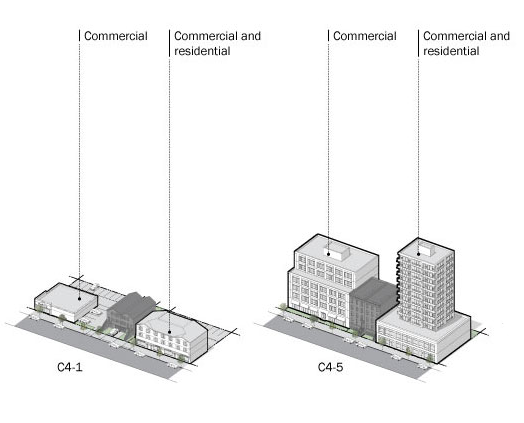
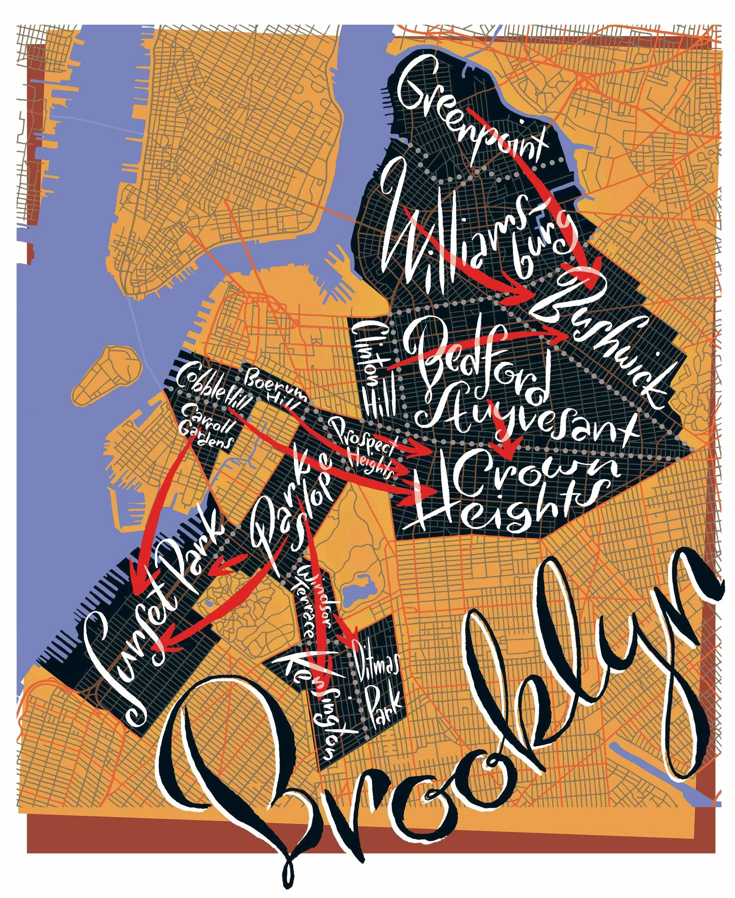
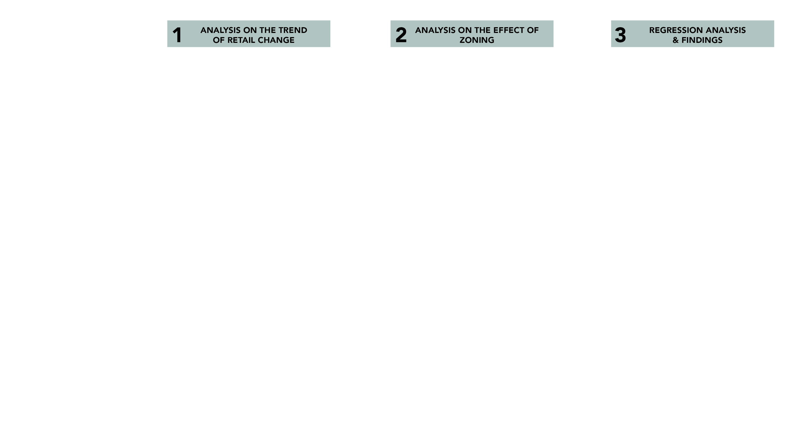

+++
title = "Yunpeng Wu_Final Presentation"
outputs = ["Reveal"]
[reveal_hugo]
theme = "black"

+++

Location Intelligence Final Report

## RETAIL DISPLACEMENT WITH REZONING IN NYC

MSAUD | Yunpeng Wu 
Instructor | Carlo Bailey 
04/15/2021

---
### overview
**How does the rezoning affect the retail displacement in New York City?** 
 

This research investigates the impact of spatial zoning on retail displacement in New York City. With longitudinal datasets of retail establishments and land use, the research explores the zoning and retail in the following aspects: First, the overall change in number and density of retail stores in NYC. Second, whether the presence of zoning affects the change of retail. Finally, study how zoning's effect performs differently on retail with different types.

---
#### Retail As Social Infrastructure

"Local small businesses are not
only good for services and access to jobs,
but are critical to the vitality of community
life. " - Jane Jacobs

---
#### Retail Displacement With Zoning

[Zoning Regulations](https://www1.nyc.gov/site/planning/zoning/districts-tools/commercial-districts-c1-c8.page)

 
Influence building typology and urban fabric 

[Moving deeper into brooklyn for lower prices - James Laish](https://www.nytimes.com/2013/03/10/realestate/moving-deeper-into-brooklyn-for-lower-home-prices.html?searchResultPosition=14)

 
Increase the rent prices 

---

### Methodology

---

### Retail Decline in New York City

---
#### The Decreasing Number of Retail Stores

<iframe frameborder="0" seamless='seamless' scrolling=no src="chart/chart1_number__change.html"></iframe>

---
#### Percentage Change in number of Retail Stores

    <iframe frameborder="0" seamless='seamless' scrolling=no src="map/map1_count_change.html"></iframe>

Percentage Change in Number of Retail Stores by Census Tract and Borough, 2009-2017

<iframe  width="100%" height="250" name="iframe" src="chart/chart2_number_change_borough.html"></iframe>

---

#### Percentage Change in density of Retail Stores

    <iframe frameborder="0" seamless='seamless' scrolling=no src="map/map2_density_change.html"></iframe>

Percentage Change in Percap Density of Retail Stores by Census Tract and Borough, 2009-2017

<iframe  width="100%" height="250" name="iframe" src="chart/chart3_density_change_borough.html"></iframe>

---

### The effect of zoning

---

---

#### focus on Commercial districts (C1-C6)

Percentage Change of Retail Floor Area, 2009 & 2017

    <iframe frameborder="0" seamless='seamless' scrolling=no src="map/map3_retailarea_change.html"></iframe>

Percentage Change of Median Property Value, 2009 & 2017

    <iframe frameborder="0" seamless='seamless' scrolling=no src="map/map4_value_change.html"></iframe>

---

### Regression Analysis 
##### in the Commercial Districts by census tract

---
#### Retail Area Change & Retail Number Change

<iframe  width="90%" height="500" name="iframe" src="chart/regression_number_area.html"></iframe>

---

#### Retail Area Change & Retail Density Change

<iframe  width="90%" height="500" name="iframe" src="chart/regression_density_area.html"></iframe>

---
#### Median Property Value Change & Retail Number Change

<iframe  width="90%" height="500" name="iframe" src="chart/regression_number_value.html"></iframe>

---

#### Median Property Value Change & Retail Density Change

<iframe  width="90%" height="500" name="iframe" src="chart/regression_density_value.html"></iframe>

--- 

### Findings
The declining trend of retail stores varies in different locations. In general, the decline in Manhattan and Bronx ara more evident than in the other boroughs. According to the rezoning map, from 2009-2017, the new commercial districts are mainly C4 type. It may suggest the trend of rezoning policy in the next few years.

There is no apparent linear relationship between retail change and the retail floor area change or property value change in the regression analysis. This result is probably due to the datasets are by census tract, limiting the study to a retail store level. Future research will try to zoom in to a smaller scale and consider how the different retail types perform.

---

##### DATASET

- Retail Establishments by Census Tract, United States, 2003-2017. National Neighborhood Data Archive (NaNDA)

- Primary Land Use Tax Lot Output - Map (MapPLUTO), 2009 & 2017. NYC Department of City Planning (DCP)

- Financial Characteristics for Housing Units by Census Tract, 2010 & 2017. American Community Survey (ACS)

 
 

##### Reference

1. [Neighbourhood Differences in Retail Turnover: Evidence from New York City](https://journals.sagepub.com/doi/full/10.1177/0042098016661268?casa_token=sb3ZQ7z6xL4AAAAA%3Af-ry7y2vtMxm5TPrZ2vcfeLVYrUwA52cNMo30xYTnik_kF5zJ_zFJn_qc-P3Ti-hGYgiie82it-C)

2. [Up-Zoning New York City's Mixed-Use Neighborhoods: Property-Led Economic Development and the Anatomy of a Planning Dilemma](https://journals.sagepub.com/doi/pdf/10.1177/0739456X04270125)

---

#### Selected Types of retail & codes

1. 442: Furniture and home furnishing stores.
2. 443: Electronics and appliance stores.
3. 444: Building material and garden supply stores, such as hardware and paint stores.
4. 448: Clothing and accessory stores
5. 451: Sporting goods, hobby, musical instrument, and book stores, including yarn shops, toy stores, and newsstands.
6. 452210: Department stores.
7. 453910: Pet and pet food stores.
8. 453310: Used merchandise stores, such as those selling secondhand clothing, furniture, and antiques.
9. 446120: Cosmetics, beauty supply, and perfume stores.
10. 446191: Food (health) supplement stores, i.e. stores selling vitamins and nutritional supplements.
11. 812111: barber shops (men’s hair stylists).
12. 812112: beauty salons (unisex and women’s hair stylists).
13. 812113: nail salons.
14. 812191: diet and weight loss centers.
15. 812199: other personal care services, which include spas, saunas, massage parlors, tattoo parlors, and tanning stations.
16. 812310: coin-operated laundries and dry cleaners (laundromats).
17. 7225: all restaurants and eating places.
18. 722410: drinking places (alcoholic beverages), such as bars, taverns, and cocktail lounges.

